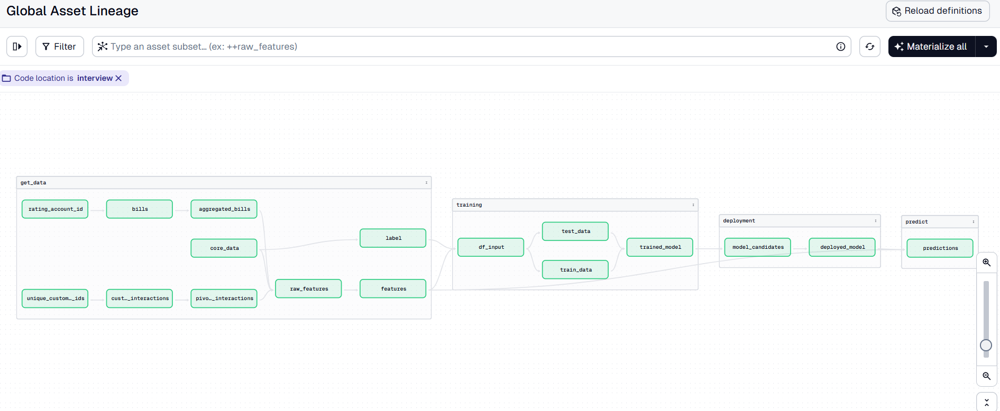

# Technical Assignment for Machine Learning Engineer Position at Magenta

Hello! You made it to the second round of interviews for the Machine Learning Engineer position at Magenta – congratulations!  
This step is designed to help us get to know each other better. You'll get the chance to work in a development environment that closely resembles the one we use at Magenta on a task that is representative of the role.

---

## Quick Start to to Codespaces

This repository contains example pipelines and data for your interview assignment.

> This setup is based on [l-mds/local-data-stack](https://github.com/l-mds/local-data-stack), which may be useful for your own data projects.  
> More info: https://georgheiler.com/post/lmds-template/

Steps to get started:

- Clone the repository to your GitHub space.
- Open a **Codespace** – setup may take 1–2 minutes.
  - 
- In the terminal, run `pixi run start-dev` – this command will start your Pixi environment.
- Open your browser and go to `https://<your-code-space-name>-<random-chars>-3000.app.github.dev/`  
  or click **"Open in Browser"** when prompted.
- You can now access the **Dagster** UI. Click **"Materialize an asset"** to view the assets we've prepared.
- You're now ready to begin the assignment.

## Your Assignment

Imagine you are a Machine Learning Engineer at Magenta and the Data Science team has reached out to you to improve the current model release process. They kindly asked you to integrate a **state-of-the-art experiment tracking and model registry solution**.

The high level requiremenets for the tool(s) are as follows:
- Can be deployed in GCP
- Different model training results can be compared
- Model release process is transparent and automated, but has human in the loop step
- Data privacy and IT security is considered (e.g. model files are stored in a secure way, no data is sent outside of Europe)
- Costs are minimised

Your task is to:

1. Understand the current model release process of a simplified data science use case in the `interview` code location and think of potential issues with it. (This video might help: https://www.youtube.com/watch?v=yG0OP-wUbzA)

2. Investigate available experiment tracking & model registry tools and select the most suitable one based on the provided requirements above.

3. Implement a prototype of the selected tool(s) and integrate it to the model release process in this repository.  

Our suggestions:

- Forking this repo makes it easy for you to work on it. Use feature branches, descriptive commits and pull requests for transparency.
- Please focus on the following folder: `src/code_location_interview/code_location_interview/assets/magenta_interview` and follow the structure provided.
- Feel free to chose any open source or commercial experiment tracking & model registry tool of your liking, but you may also implement a custom solution.
- As for prototype, we would like to see a solution that can run locally (on Codespaces). We like to work with containerised applications, but happy to see any creative soltuion that makes sense to you.
- Aim towards a good enough implementation, we don't expect it to be perfect, after all it is only a prototype.
- Be ready to explain your code to us and why you implemented it in this way.

## Presentation

During the the technical interview, you will have a chance to present us:
- your findings about the current model release process
- which tool(s) you selected and why
- the improved model release process (ideally with a live demo)
- your code/implementation

On top of this, we will have a discussion about a hypothetical production rollout of the selected tool(s). 
Here are some of the questions we might ask:
- How would the architecture look like?
- What are the infrastructure requirements?
- What kind costs do you expect?
- What IT security and data privacy relevant risks do you forsee?
- What are the high level tasks for the production rollout? What do you think is a reasonable timeline for the rollout?

Our suggestions:

- Feel free to prepare any material you think might help you in the presentation / discussion. 
- Be ready to demo your implementation using Codespaces. 

## Useful Links

- Pixi: https://pixi.sh/latest/advanced/installation/
- Dagster: https://dagster.io/  
  Further learning: https://courses.dagster.io/
  Example of ML model release with Dagster: https://www.youtube.com/watch?v=yG0OP-wUbzA
