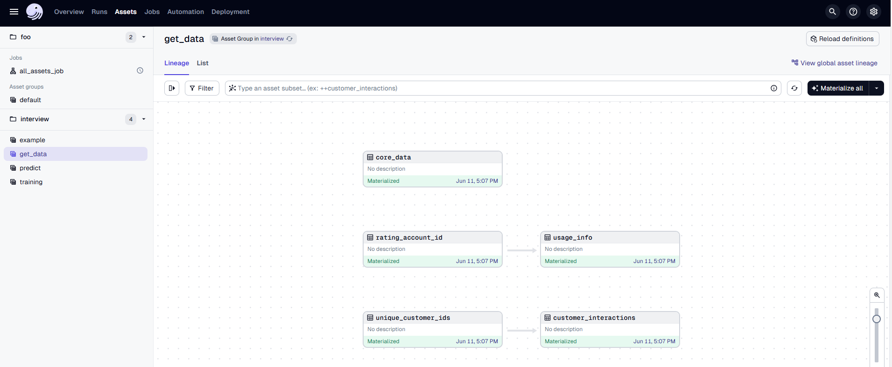
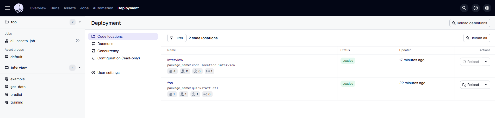

# Coding Assignment for Data Scientist Position at Magenta

Hello! You made it to the second round of interviews for the Data Scientist position at Magenta – congratulations!  
This step is designed to help us get to know each other better. You'll get the chance to work in a development environment that closely resembles the one we use at Magenta.

---

## Quick Start

This repository contains example pipelines and data for your interview assignment.

> This setup is based on [l-mds/local-data-stack](https://github.com/l-mds/local-data-stack), which may be useful for your own data projects.  
> More info: https://georgheiler.com/post/lmds-template/

Steps to get started:

- Clone the repository to your GitHub space.
- Open a **Codespace** – setup may take 1–2 minutes.
  - <a href='https://codespaces.new/telekom/data-scientist-at-magenta'></a>
- In the terminal, run `pixi run start-dev` – this command will start your Pixi environment.
- Open your browser and go to `https://<your-code-space-name>-<random-chars>-3000.app.github.dev/`  
  or click **"Open in Browser"** when prompted.
- You can now access the **Dagster** UI. Click **"Materialize an asset"** to view the assets we've prepared.
- You're now ready to begin the assignment.


## Your Assignment

Imagine you are a data scientist at Magenta and your task is to pitch a new use case for upselling activities to the marketing department.  
The goal is to apply machine learning to better identify which customers to target for upselling campaigns.

> **Upselling**: When a customer upgrades to a better and more expensive product.  
> Example: A customer currently has a mobile contract with 10 GB data. After a marketing intervention, they upgrade to a 50 GB tariff.

### The assignment consists of two parts:

---

### 1. Model implementation

We’ve prepared three datasets:

- `core_data`: contract-level information
- `usage_info`: data usage and roaming activity from the past 3 months
- `customer_interactions`: customer service interaction records in the last 6 months

To access all sample data, materialize the assets in the `get_data` group under the `interview` folder:



You can explore the materialized data in the notebook located at `notebooks/explore.ipynb`. 
This notebook also provides a more detailed description of the datasets. To run the code, you can use the `dev` Jupyter kernel.

We encourage you to integrate your code into this repository, following the existing structure.  
Specifically, we expect you to implement the model training and inference as Dagster assets.  
Please contribute to the following folder: `src/code_location_interview/code_location_interview/assets/magenta_interview`.  
We've provided a basic structure to help you get started, but feel free to modify or extend it as needed.  

Feel free to use notebooks for exploration porpuse.  
Be ready to explain your code to us, for example why you choose specific model, which explorative analysis you run, which metric you implemented etc (commenting the code will help everybody in this exercise ;) ).

Please also keep in mind that the data is randomly generated — we don’t expect your model to have the highest accuracy.  
The goal is to see how you approach a data science task, how you explain your choices, and how you evaluate your results (e.g. through performance metrics, interpretation of outcomes, and reflections on limitations).

**Disclaimer**  
We understand that this repository contains more than needed and introduces several new tools at once.  
We really appreciate your flexibility and your ability to learn fast. What matters most to us is how you approach this challenge — not having a perfect model or the most optimized code.  
If building Dagster assets turns out to don't work as expected, feel free to use a notebook instead or just give it a try anyway.


> Tip: After changing or creating assets, reload them in Dagster to reflect updates:




---

### 2. Presentation Part

Use any tool you prefer (e.g., PowerPoint, Google Slides) to prepare a **20-minute presentation** for a **non-technical business audience**.

Imagine you are in the early phase of the project. You’ve performed some exploratory analysis and now you’re presenting your idea to stakeholders.

> The presentation does not need to reflect only what you’ve implemented in code.  
> Feel free to assume access to more features or experimentation with different approaches.

Please cover the following points:

- What is the scope of the project
- Which input features you would like to use for the model
- What modeling approach you propose
- What metric you would use to measure success
- How you would compute the business value generated by your model
- Which stakeholders you would involve and at what stages


## Useful Literature

- Pixi: https://pixi.sh/latest/advanced/installation/
- Dagster: https://dagster.io/  
  Further learning: https://courses.dagster.io/
- dbt: https://www.getdbt.com/

## advanced usage
### docker

```bash
docker compose -f docker-compose.yml --profile dagster_onprem up --build
```

### .env  file

Post install:

- update the secrets in the `.env` files by executing: `openssl rand -base64 32` and setting a suitable secret
- ensure the `.env.enc` can be created by following the instructions in [documentation/secops]

here you find an example `.env` file which should have been auto-generated

```
DO_NOT_TRACK=1

WAREHOUSE_DAGSTER_HOSTNAME=dagster_db
WAREHOUSE_DAGSTER_DB=dagster
WAREHOUSE_DAGSTER_USER=dagster
# openssl rand -base64 32
WAREHOUSE_DAGSTER_PASSWORD=<<your-secret>>

# only set this for dev mode!
DAGSTER_IS_DEV_CLI=True

# only set in the container (should be done from CI pipeline)
#DAGSTER_CLOUD_DEPLOYMENT_NAME=techexploration
#DAGSTER_CLOUD_GIT_URL=https://github.com/myorg/interview
#DAGSTER_CLOUD_GIT_SHA=<<your sha>>
#DAGSTER_CLOUD_GIT_BRANCH=main
```
